# Predicting British Airways customer buying behavior

### *Build a predictive model that identifies the factors influencing whether a customer will complete a booking.*

### Table of Contents
* [Introduction](#Introduction)
* [Data Wrangling](#Data_Wrangling)
* [Exploratory Data Analysis](#EDA)
* [Data Pre-processing](#Data_Pre-processing)
* [Data Modeling](#Data_Modeling)
* [Conclusion](#Conclusion)
* [Future Directions](#Future_Directions)

### Introduction

The aviation industry has undergone a fundamental shift in how customers make purchasing decisions. Today's customers are more empowered than ever — they have access to a wealth of information at their fingertips, which means the buying cycle looks very different from what it used to be. Airlines can no longer afford to be reactive; waiting until a customer arrives at the airport to purchase a flight or holiday is simply too late. British Airways must instead be proactive in acquiring customers before they begin their holiday journey.

To achieve this, data and predictive modelling play a central role. The quality of training data is the most critical factor in building an effective machine learning model — which is why careful data preparation is emphasized as a core part of this task.

Our goal is to *build a predictive model that identifies the factors influencing whether a customer will complete a booking*. Specifically, we will:

- *Explore and prepare the dataset* — Understand the customer booking data (provided as customer_booking.csv), analyze its columns and statistics, and engineer any new features that could improve model performance.
- *Train a machine learning model* — Use an interpretable algorithm (such as a Random Forest) that can predict whether a customer makes a booking and reveal how much each variable contributes to that prediction.
- *Evaluate the model and present findings* — Assess model performance using cross-validation and relevant evaluation metrics, create a variable importance visualization, and summarize key findings in a single PowerPoint slide for upper management.

### Data Wrangling

[Data Wrangling Notebook](Notebooks/BA_Predictive_Modeling_Data_Wrangling_EDA.ipynb)

The key data source is a single CSV file, with 50000 rows and 14 columns, which can be downloaded from [customer_booking.csv](Raw_Data/customer_booking.csv). Each row represents a customer booking session, and the columns describe both the trip itself (route, duration, day-of-week, hour) and customer-level choices (number of passengers, ancillary purchases such as baggage, preferred seat, and in-flight meals). The target variable, `booking_complete`, is a binary flag indicating whether the customer actually completed the booking.

A first pass over `.info()` confirmed that the dataset has no missing values, but a handful of columns required type conversion before any statistics could be computed. The most obvious one was `flight_day`, which was stored as a string (`Mon`, `Tue`, …, `Sun`). It was label-encoded to an integer 1–7 so that downstream visualisations and tree-based learners could use it directly.

Beyond raw cleaning, several engineered features were created to give the model richer signal:

- `departure_city` and `arrival_city` — extracted from the first three and last three characters of the IATA `route` string.
- `departure_country` and `arrival_country` — derived from the IATA codes using the `airportsdata` and `pycountry` libraries. Two IATA codes (`REP` — Siem Reap, Cambodia) were not present in the lookup and were back-filled manually so that the country columns ended up complete for all 50,000 rows.
- `add_ons_count` — the sum of `wants_extra_baggage`, `wants_preferred_seat`, and `wants_in_flight_meals`, giving a single ancillary-engagement signal in the range 0–3.
- `is_weekend` — whether the flight departs on Saturday or Sunday.
- `booking_urgency` — whether the customer booked with less than the median lead time (a proxy for "last-minute" behaviour).
- `long_haul` — whether the flight duration is above the median duration.
- `is_AM` — whether the flight departs before noon.
- `is_domestic` — whether departure and arrival countries are the same. After inspecting the correlation matrix this feature was zero-variance in the sample (all flights crossed borders) and was dropped before modelling.

The cleaned and feature-engineered dataset was saved to [customer_booking_v1.csv](Data/customer_booking_v1.csv) as the input to the modelling pipeline.

### EDA

[EDA Notebook](Notebooks/BA_Predictive_Modeling_Data_Wrangling_EDA.ipynb)

A quick scan of the categorical features shows that the booking funnel is very heavily skewed toward a few dominant categories. The overwhelming majority of bookings come through the **Internet** sales channel rather than mobile, and almost all bookings are **RoundTrip** — `CircleTrip` and `OneWay` together account for only a sliver of the data.

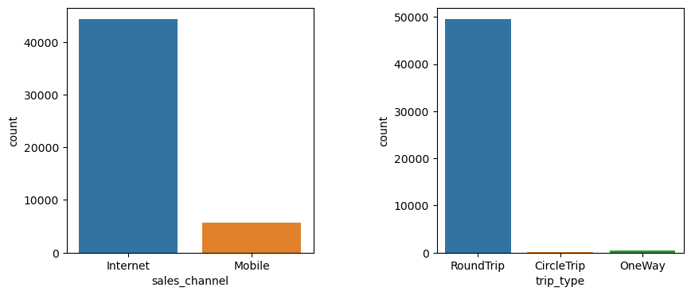

Booking origin is also concentrated. Australia is by far the largest source market, followed by Malaysia, South Korea, Japan, China, and Indonesia — i.e. the dataset reflects an Asia-Pacific-heavy network rather than a UK-centric one.

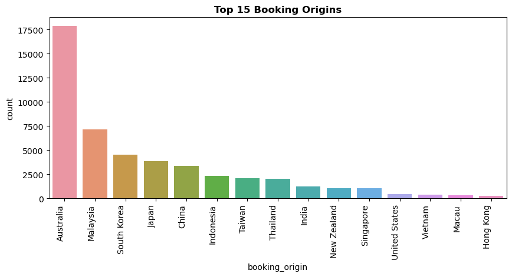

Decomposing `route` into departure and arrival cities reveals that the top departure airports include DMK (Bangkok–Don Mueang), ICN (Seoul), MEL (Melbourne), DPS (Denpasar/Bali), and AKL (Auckland), while the top arrival airports are dominated by SYD, PER, MEL, and TPE. The single most common O-D pair in the data is AKL → KUL.

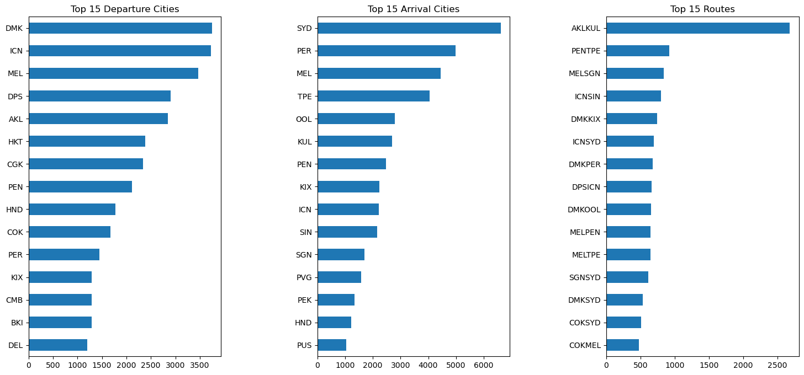

The marginal distributions of the numeric and engineered features show the usual aviation-data shape: `num_passengers`, `purchase_lead`, and `length_of_stay` are strongly right-skewed (most customers book for one or two passengers, within a few months of travel, for a short trip), while `flight_hour` and `flight_day` are roughly uniform. The target itself is imbalanced — only about **15%** of sessions end in a completed booking — which is an important fact for evaluation strategy later.

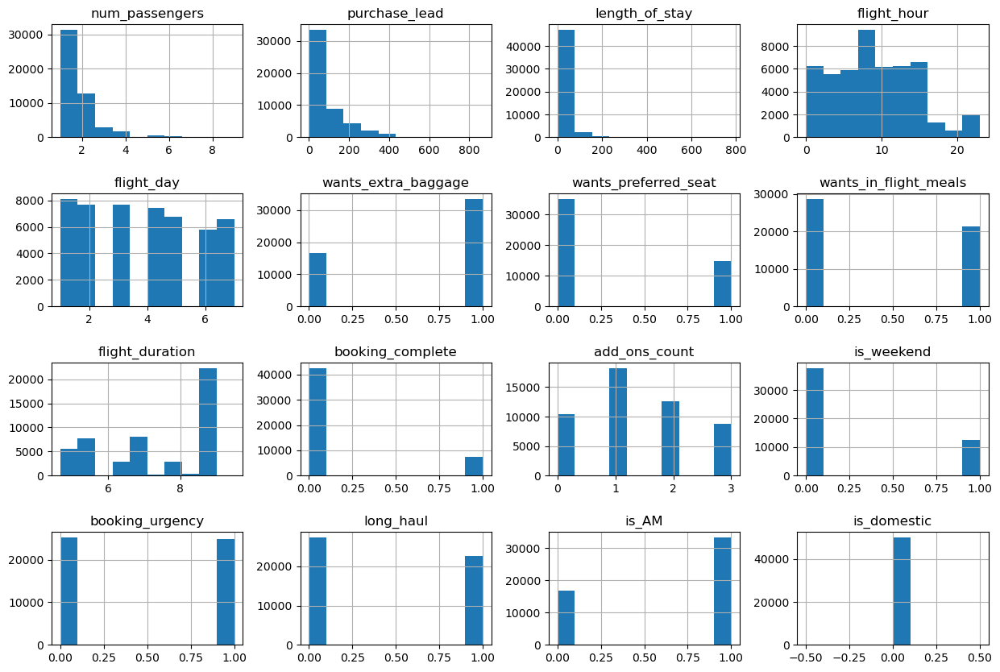

The Pearson correlation heatmap is mostly cool, indicating that the predictors are largely independent of one another. The strongest visible relationship is the (mechanical) negative correlation between `purchase_lead` and the derived `booking_urgency` flag, and a positive cluster between the three ancillary flags and their `add_ons_count` aggregate. Crucially, no single feature shows a strong linear correlation with `booking_complete` — which already hints that a non-linear, tree-based model is likely to outperform a linear baseline.

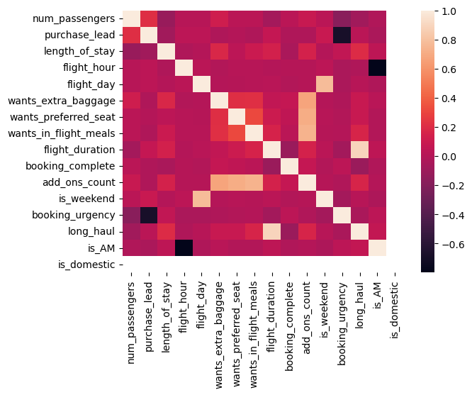

### Data Pre-processing

[Data Pre-processing Notebook](Notebooks/BA_Predictive_Modeling_Pre-processing_Modeling.ipynb)

Before training, the categorical columns and the heavily-skewed numeric columns needed to be transformed into a form that classifiers can consume.

Encoding strategy was chosen per-column based on cardinality:

- `sales_channel` (two levels) was **one-hot encoded with `drop_first=True`**, producing a single `sales_channel_Mobile` indicator.
- `trip_type` (three levels) was **one-hot encoded with all levels kept**, since the three categories are not ordinal and dropping one would make the comparison baseline awkward.
- `booking_origin`, `route`, `departure_city`, `arrival_city`, `departure_country`, and `arrival_country` are all high-cardinality (hundreds of distinct values). One-hot encoding would have exploded the feature space, so **binary encoding** (via `category_encoders.BinaryEncoder`) was used instead — each category is mapped to a compact set of binary columns (typically 5–10 per feature).

The numeric features (`num_passengers`, `purchase_lead`, `length_of_stay`, `flight_hour`, `add_ons_count`, `flight_duration`) are very skewed in raw form:

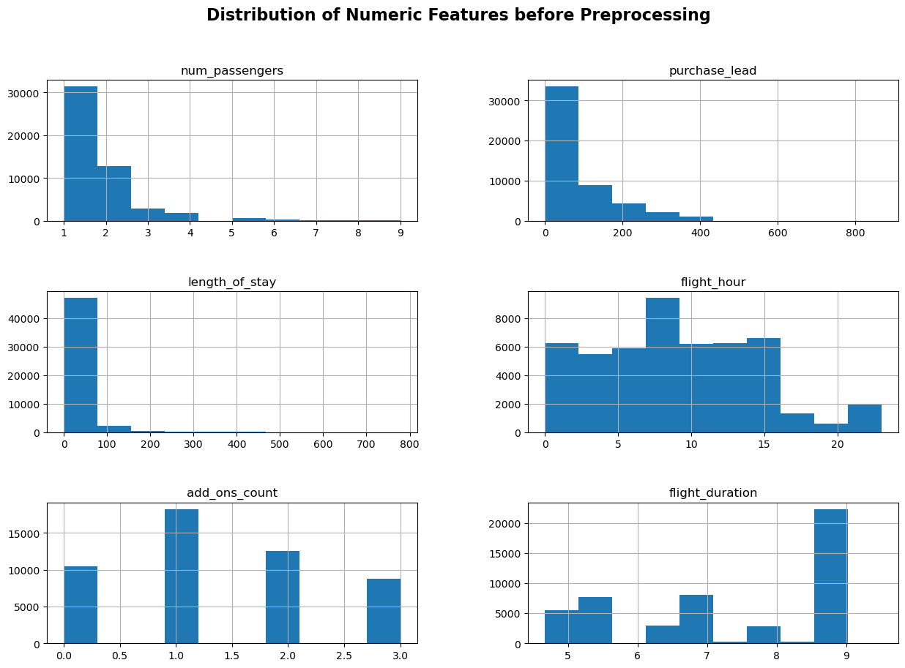

A pipeline of **`PowerTransformer` → `StandardScaler`** was fit on the training fold only and applied to both train and test. After the transformation the distributions are noticeably more Gaussian and centred at zero with unit variance, which makes the data well-behaved for any distance- or gradient-based learner (Logistic Regression, Linear SVM, Gradient Boosting):

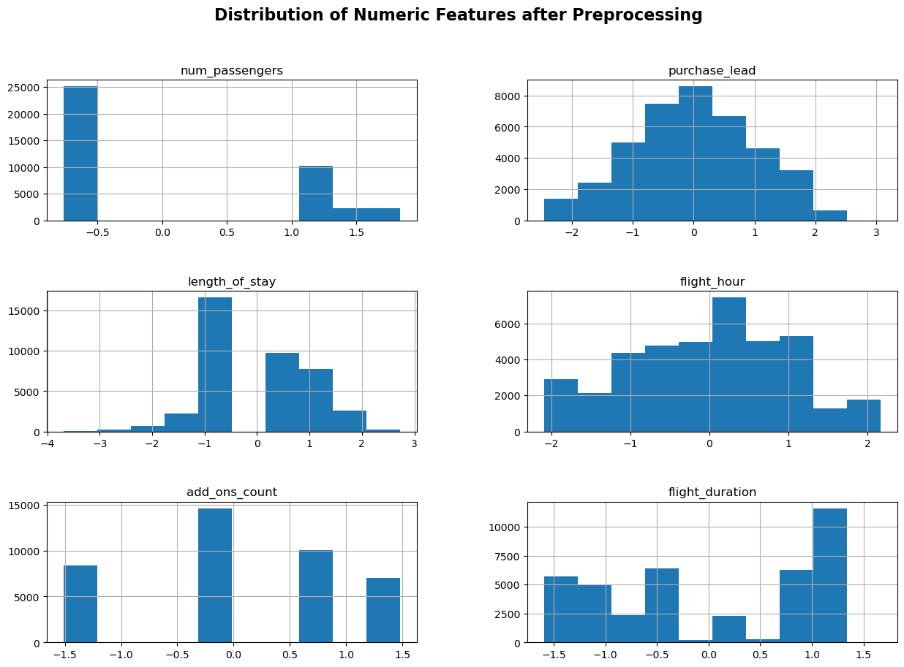

The data was split 80/20 with stratification on the target (`random_state=22`) to preserve the 15% positive-class rate in both folds, and the four resulting frames (`X_train`, `X_test`, `y_train`, `y_test`) were persisted to disk for reproducibility.

### Data Modeling

[Data Modeling Notebook](Notebooks/BA_Predictive_Modeling_Pre-processing_Modeling.ipynb)

**Baseline screening.** Six classifiers were first compared head-to-head with 5-fold cross-validation on the training set, using class-balanced sample weights to compensate for the 85/15 imbalance: Naive Bayes, Logistic Regression, Decision Tree, Random Forest, Gradient Boosting, and Linear SVM.

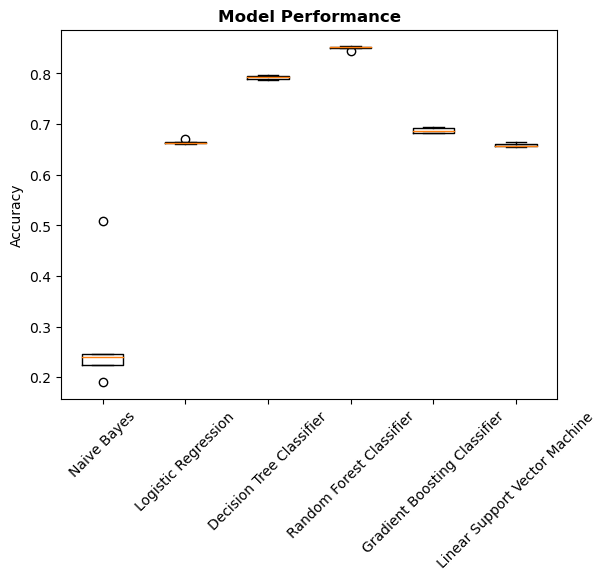

The three tree-based learners clearly dominated; **Random Forest** posted the highest mean accuracy (~0.85), with Decision Tree and Gradient Boosting close behind. The linear models and Naive Bayes were much weaker, which is consistent with the earlier observation that no single feature is linearly correlated with `booking_complete`.

**Hyperparameter tuning.** The three top performers were then tuned:

| Model | Search | Best parameters | CV accuracy |
|---|---|---|---|
| Decision Tree | GridSearchCV | `criterion='entropy'`, `max_depth=31` | 0.793 |
| Random Forest | RandomizedSearchCV | `criterion='entropy'`, `n_estimators=1000`, `max_depth=15` | **0.852** |
| Gradient Boosting | RandomizedSearchCV | `n_estimators=1000`, `learning_rate=0.1`, `max_depth=6` | 0.804 |

**Held-out evaluation.** With the tuned hyperparameters re-fit on the full training set and evaluated against the test set, Random Forest remained the strongest model on every threshold-free metric we care about:

| Model | Test Accuracy | Macro F1 | Log-loss | ROC AUC | PR AUC |
|---|---|---|---|---|---|
| Decision Tree | — | — | — | 0.593 | 0.197 |
| **Random Forest** | **0.802** | **0.655** | **0.413** | **0.793** | **0.386** |
| Gradient Boosting | 0.793 | 0.641 | 0.442 | 0.763 | 0.360 |

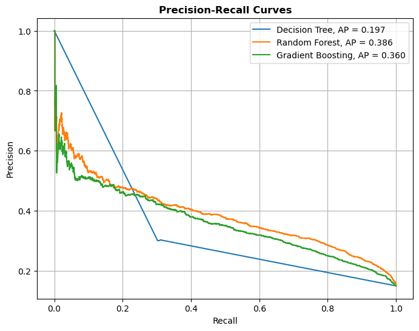

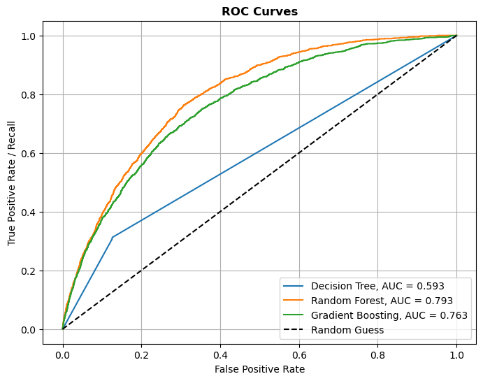

The Random Forest's AUC of 0.793 means that, given one randomly chosen completed booking and one randomly chosen abandoned session, the model gives the completed-booking customer a higher predicted probability roughly 79% of the time — a solid lift over the 0.5 baseline of random guessing.

**Threshold selection.** Because the positive class is rare, the default 0.5 cut-off is not necessarily the right operating point. Sweeping the decision threshold on the Random Forest's predicted probabilities exposes a clear precision/recall trade-off:

| Threshold | Precision | Recall | F1 | Accuracy |
|---|---|---|---|---|
| 0.1 | 0.191 | **0.977** | 0.319 | 0.377 |
| 0.2 | 0.249 | 0.872 | 0.387 | 0.587 |
| 0.3 | 0.301 | 0.767 | 0.433 | 0.699 |
| 0.4 | 0.338 | 0.618 | **0.437** | 0.762 |
| 0.5 | 0.377 | 0.496 | 0.429 | **0.802** |

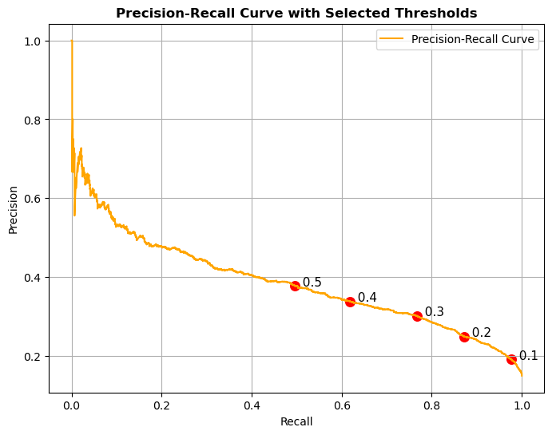

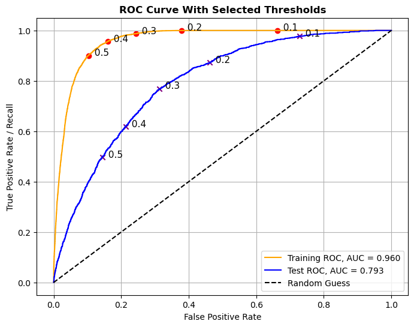

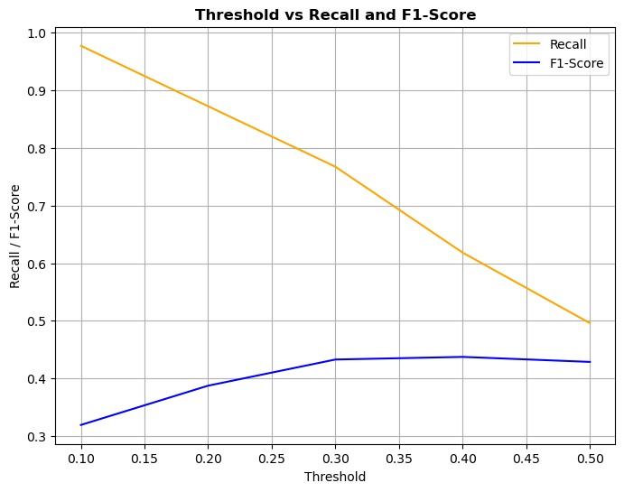

The train ROC AUC of 0.960 vs. test AUC of 0.793 indicates some overfitting (expected for a deep Random Forest), but the test AUC is stable and the macro-F1 peaks at threshold ≈ 0.4. If the business priority is *catching as many would-be bookers as possible* for a retargeting campaign (high recall), the threshold should be pushed down to 0.2–0.3. If the priority is *not bothering uninterested customers* (high precision), 0.5 is the better operating point.

**Feature importance.** The most actionable output of the Random Forest is the ranking of variables by how much they contribute to splitting decisions across the 1,000 trees:

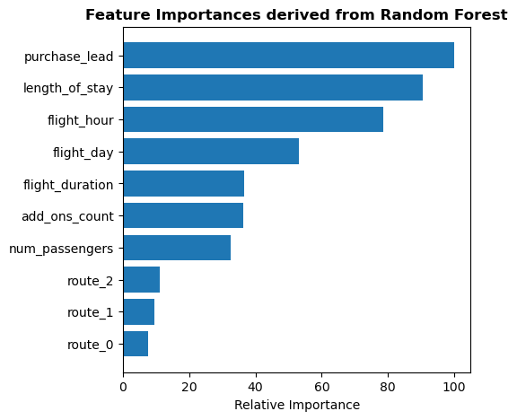

The top four features — `purchase_lead`, `length_of_stay`, `flight_hour`, and `flight_day` — together drive the vast majority of the model's discriminative power. The next tier (`flight_duration`, `add_ons_count`, `num_passengers`) provides meaningful but smaller lift, and the route binary columns matter only marginally once the temporal and trip-shape features are accounted for. Notably, the ancillary flags individually rank below their aggregate `add_ons_count`, which validates the feature-engineering choice.

### Conclusion

A tuned Random Forest classifier is able to predict whether a customer will complete a booking with a test accuracy of **0.80**, ROC AUC of **0.79**, and macro F1 of **0.66**, comfortably beating linear baselines and edging out Gradient Boosting on every metric we tracked. The strongest predictors are **how far in advance the customer is shopping** (`purchase_lead`), **the length of stay**, and the **timing** of the flight (`flight_hour`, `flight_day`) — i.e. the *when* of the trip matters more than the *where* once core temporal signals are in the model.

For the business, this reframes the marketing problem. Booking completion is not primarily about *who* the customer is or *which* route they are looking at; it is about *when* they are shopping and *what kind of trip* they are planning. That suggests concrete levers:

- **Early-bird customers (high `purchase_lead`)** are a distinct cohort and respond well to price-lock guarantees, fare-hold offers, and timely reminder emails.
- **Short vs. long stays** signal trip purpose — business vs. leisure — and can be served different ancillary bundles (flexibility for business, baggage/meal bundles for leisure).
- **Off-peak flight hours and weekdays** convert worse than peak slots and are obvious candidates for small fare incentives or convenience-led messaging.

Because Random Forest feature importance shows *association*, not *causation*, these insights should drive the design of **A/B tests** — for example, testing whether a fare-hold offer aimed at high-`purchase_lead` shoppers actually lifts completion — rather than being deployed as if they were known causal effects.

### Future Directions

Several extensions would meaningfully improve both the model and its operational value:

- **Address class imbalance more aggressively.** Sample weighting helped, but techniques such as SMOTE/ADASYN on the training fold, focal-loss-based boosters, or calibration via isotonic regression would likely raise the rare-class precision without sacrificing recall.
- **Reduce the train/test ROC AUC gap (0.960 vs. 0.793).** Stricter regularisation (smaller `max_depth`, larger `min_samples_leaf`), or moving to a calibrated XGBoost/LightGBM/CatBoost model with early stopping, should narrow the overfitting gap.
- **Add temporal and behavioural context.** The current dataset is a single snapshot per session. Joining in session-level browsing behaviour (search count, page dwell time, prior abandoned baskets, device type, time-of-day of *the search* rather than only the flight) is where most of the remaining lift will come from.
- **Enrich the route features.** Replace the high-cardinality binary-encoded route columns with engineered signals such as *route-level historical conversion rate*, *route popularity decile*, or *seasonality of the O-D pair* — these typically outperform encoded identifiers on tree-based models.
- **Operationalise the threshold.** Instead of a single fixed cut-off, expose the predicted probability to the marketing system and let business stakeholders pick the threshold per campaign (e.g. 0.2 for broad retargeting funnels, 0.5 for high-cost interventions). Re-evaluate quarterly as the booking mix shifts.
- **Move toward causal inference.** The variable-importance plot identifies *associations*. Designing the next round of A/B tests around the top features — particularly `purchase_lead` and flight timing — is the natural next step before any pricing or messaging change is rolled out widely.

---